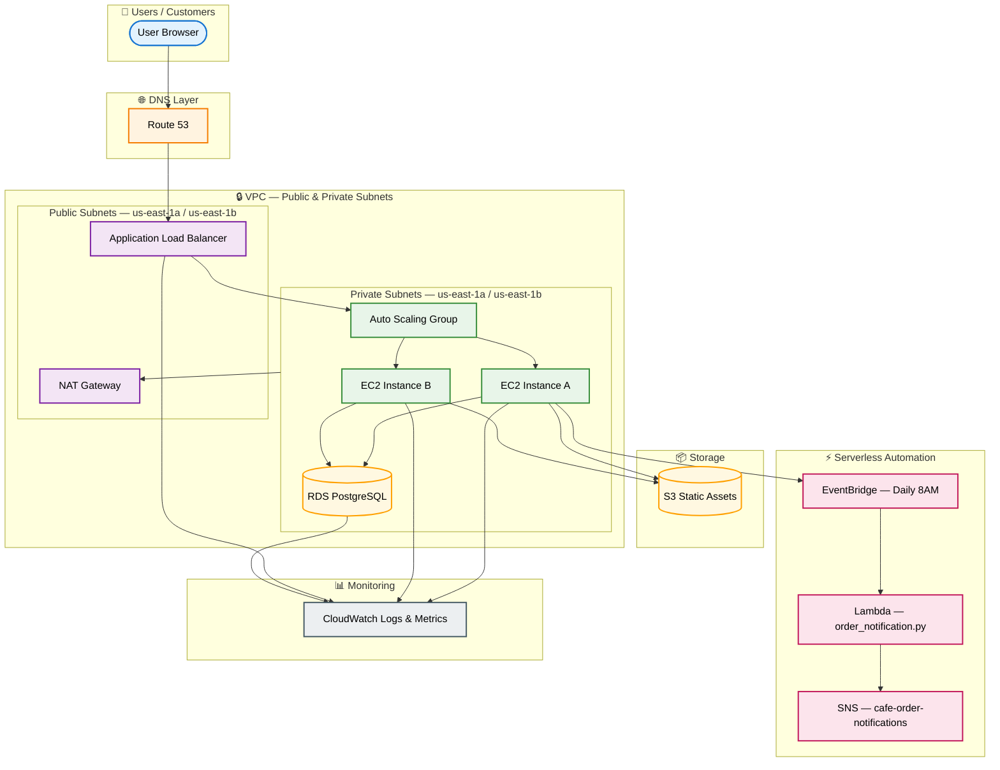

# Café Nimbus — AWS Infrastructure Architecture Case Study

### Five-Phase AWS Architecture · Availability, Segmentation, Automation, and Production Readiness

**Md Rahat Islam Anik · Cloud Infrastructure Case Study · 2026**

---

| 5 Phases | 13 AWS Services | Architecture Design | Production Readiness Review |
|:---:|:---:|:---:|:---:|

---

## The Problem

Café Nimbus is a business-style AWS scenario: a growing café brand needs to move beyond a fragile single-server model and plan for availability, network segmentation, reproducible deployments, scaling, and scheduled reporting automation.

## The Solution

A 5-phase AWS architecture case study: static hosting with cross-region replication, a reproducible LAMP-stack pattern with a golden AMI, VPC network segmentation with private subnets and bastion access, a multi-AZ load balancing and Auto Scaling design, and a serverless daily reporting workflow using Lambda, SNS, and EventBridge.

**The design shows how the environment could scale, recover, and reduce manual reporting work when implemented and validated in AWS.**

---

> *"Café Nimbus is an AWS architecture case study showing how a fragile single-server environment can be redesigned into a segmented, scalable, and automation-ready cloud platform."*

---

## Architecture

> ALB in public subnets — EC2, RDS in private subnets — no public IPs on application layer.
> See [DESIGN-DECISIONS.md](DESIGN-DECISIONS.md) for architectural rationale.

---
## The Engagement

Café Nimbus is a growing café brand preparing for expansion. In this scenario, their online presence depends on a fragile single-server model: limited redundancy, limited backup strategy, limited scaling, and no automation plan for recurring operations work.

The mandate: design an AWS infrastructure that could grow with the business, reduce single points of failure, and automate repeatable reporting work where serverless services make sense.

What followed was a five-phase architectural engagement. Each phase solved a specific business problem. Each phase made the next one possible.

---

## Five Phases

### Phase 01 — Get Online
**Amazon S3 · Versioning · Lifecycle Policies · Cross-Region Replication**

**The Problem:** Café Nimbus had no web presence. Customers were finding competitors instead. The site needed to be fast, cheap to run, and impossible to accidentally break during a content update.

**Architecture Pattern:** Static website on Amazon S3 with public access controlled through bucket policy. S3 versioning, lifecycle policy, and cross-region replication are included as availability and recovery controls.

**Validation Plan:**
- Confirm site access through S3 static website hosting or CloudFront
- Confirm blocked access before public bucket policy is applied
- Test file version restore
- Confirm object replication to destination bucket

> **The principle:** Replication from day one, not after the first outage. The cost of preventing a disaster is always lower than the cost of recovering from one.

---

### Phase 02 — Get Dynamic
**EC2 · LAMP Stack · AMI Golden Image · Multi-Region Deployment**

**The Problem:** A static site can display a menu. It cannot take orders, manage inventory, or run a real application. Café Nimbus needed a backend — and one that could be reproduced exactly if it ever had to be rebuilt.

**Architecture Pattern:** EC2 running a LAMP stack — Linux, Apache, MySQL, PHP. After application validation, a golden AMI would be created so the application server can be rebuilt consistently.

**Validation Plan:**
- Confirm Apache and PHP application availability
- Confirm menu/order workflow and database persistence
- Create AMI from configured instance
- Launch replacement instance from AMI and compare configuration

> **The principle:** A manually configured server is a liability. An AMI is an asset. The cost of creating it is an hour. The cost of not having it is a full rebuild under pressure.

---

### Phase 03 — Get Secure
**Custom VPC · Bastion Host · NAT Gateway · Network ACLs**

**The Problem:** The platform was going public with no meaningful network boundaries — everything was reachable from everywhere. Security had to be layered. A single misconfigured security group should not be enough to expose the entire backend.

**Architecture Pattern:** Custom VPC with public and private subnet separation. Public subnets host internet-facing entry points such as ALB and bastion access; private subnets host application and database resources. NAT Gateway provides outbound-only internet access for private resources, and NACLs add a stateless subnet control layer.

**Validation Plan:**
- Confirm private instances are not directly reachable from the internet
- Confirm bastion or Session Manager access path
- Confirm private subnet outbound routing through NAT Gateway
- Test NACL deny and allow behavior

> **The principle:** Backend resources should avoid direct public exposure. Security groups and NACLs together provide layered controls, but production still needs logging, monitoring, and access review.

---

### Phase 04 — Get Scalable
**Application Load Balancer · Auto Scaling Group · Multi-AZ**

**The Problem:** A single EC2 instance — no matter how well configured — is a single point of failure. When traffic spikes during a promotion, the site goes down. When the instance fails, the business goes dark. Neither is acceptable for a company preparing for national expansion.

**Architecture Pattern:** Application Load Balancer across two Availability Zones with an Auto Scaling Group. CPU utilization is used as the example scaling trigger, with health checks and replacement behavior included in the design.

**Validation Plan:**
- Confirm ALB target registration across both Availability Zones
- Run controlled load test to trigger scale-out
- Terminate one instance and confirm ASG replacement
- Confirm scale-in behavior after load drops

> **The principle:** Multi-AZ is not a luxury. A single-AZ deployment with ten instances is still a single point of failure. Two AZs with two instances each is genuinely resilient.

---

### Phase 05 — Get Autonomous
**AWS Lambda · Amazon SNS · Amazon EventBridge**

**The Problem:** Every morning, the operations team spent 45 minutes manually pulling the previous day's sales data and emailing it to management. Error-prone, time-consuming, and entirely unnecessary.

**Architecture Pattern:** Two Lambda functions — `DataExtractor` for collecting data and `SalesAnalysisReport` for formatting the report. SNS delivers the report to a distribution list, and EventBridge triggers the workflow on a daily schedule.

**Validation Plan:**
- Confirm Lambda VPC access where required
- Confirm report data extraction and formatting
- Confirm SNS subscription delivery
- Confirm EventBridge scheduled invocation

> **The principle:** Lambda, not a cron job on EC2. Lambda runs only when triggered — monthly cost at this workload is effectively zero. An EC2-based cron costs $15–30/month to idle 24/7 for a task that executes once per day. Serverless is not always the right answer. Here, it is the only answer.

---

## Architecture Decision Log

| Decision | Chosen | Rejected | Rationale |
|---|---|---|---|
| Static hosting | S3 + bucket policy | EC2-hosted static site | No reason to run compute for files that never change |
| Content protection | S3 versioning day one | No versioning | Accidental overwrites have no recovery path without it |
| Regional resilience | Cross-region replication | Single-region only | One regional outage = total web presence loss |
| Server reproducibility | AMI before repeat deploy | Manual reconfiguration | A manually built server cannot be rebuilt reliably under pressure |
| Backend access | Bastion host only | Direct SSH + public IP | No backend resource should ever have a direct public route |
| Outbound private traffic | NAT Gateway | Public subnet for EC2s | Private isolation requires outbound-only — not bidirectional |
| Network defence | SGs + NACLs combined | Security groups alone | One misconfigured SG without NACLs = open door |
| Scaling trigger | CPU utilization | Scheduled scaling | Traffic is demand-driven, not time-predictable |
| AZ strategy | Multi-AZ ALB + ASG | Single-AZ more instances | Single AZ is a single point of failure regardless of instance count |
| Reporting automation | Lambda + EventBridge | Cron job on EC2 | Idle compute 24/7 for a 30-second daily task |

---

## Tech Stack

| Service | Role |
|---|---|
| Amazon S3 | Static hosting, versioning, lifecycle policies, cross-region replication |
| Amazon EC2 | Application compute, LAMP stack, bastion host |
| Amazon VPC | Network isolation, public/private subnet segmentation |
| Internet Gateway | Public subnet internet access |
| NAT Gateway | Outbound-only internet access for private subnet |
| Network ACLs | Stateless subnet-level traffic control |
| Application Load Balancer | Traffic distribution across AZs, health checking |
| Auto Scaling Group | Demand-based compute scaling, auto instance replacement |
| AWS Lambda | Serverless data extraction and report generation |
| Amazon RDS | Managed MySQL database for application data |
| Amazon SNS | Email notification delivery for sales reports |
| Amazon EventBridge | Scheduled Lambda trigger — 8AM daily |
| AWS AMI | Golden image capture for reproducible deployments |

---

## Evidence Status

| Area | Status | Notes |
|---|---|---|
| AWS architecture flow | Documented | Architecture is described in README and live HTML case study |
| Static hosting pattern | Designed | No retained AWS screenshots in this repository |
| LAMP/AMI pattern | Designed | No retained EC2 screenshots or server build scripts |
| VPC segmentation pattern | Designed | No retained VPC/subnet/route-table screenshots |
| ALB and Auto Scaling pattern | Designed | No retained load-test screenshots or metrics |
| Lambda/SNS/EventBridge reporting pattern | Designed | No retained Lambda code or delivery screenshots |
| Production hardening gaps | Documented | WAF, CloudTrail, Secrets Manager, VPC endpoints, and monitoring are listed as production additions |

See [docs/evidence-map.md](docs/evidence-map.md) for the evidence and validation map.

---

## Limitations

This repository currently documents the AWS architecture and decision-making process. It does not include retained AWS console screenshots, infrastructure-as-code, application source code, Lambda code, CloudWatch metrics, or load-test output.

To present this as a fully implemented build, the repository would need screenshot evidence or source artifacts for each phase. Until then, it should be read as an AWS architecture and production-readiness case study.

---

## What I'd Add in Production

**AWS WAF on ALB** — The load balancer is publicly exposed. Without a Web Application Firewall, SQL injection and XSS have no automated defence at the network edge.

**RDS + Secrets Manager** — In a hardened environment, RDS credentials would be rotated automatically through Secrets Manager — no application code would contain a hardcoded password.

**CloudTrail — All Regions** — Every API call in the account should be logged. Without CloudTrail, there is no audit trail if something goes wrong.

**VPC Endpoints for S3** — Traffic between EC2 and S3 currently routes through NAT Gateway. VPC Endpoints keep that traffic on the AWS private network and eliminate the NAT cost.

**CloudWatch Dashboard** — ALB request count, ASG instance count, Lambda errors, and RDS connections — all visible in one place, with SNS alarms on threshold breach.

**WAF + Shield** — For a nationally expanding brand, DDoS protection at the ALB layer moves from a nice-to-have to a business continuity requirement.

---

## Skills Demonstrated

`Amazon S3` · `EC2` · `VPC Design` · `Subnetting` · `Bastion Host` · `NAT Gateway` · `Network ACLs` · `Security Groups` · `Application Load Balancer` · `Auto Scaling` · `Multi-AZ Architecture` · `AWS Lambda` · `Amazon RDS` · `Amazon SNS` · `Amazon EventBridge` · `AMI` · `LAMP Stack` · `Cross-Region Replication` · `Serverless Architecture` · `Infrastructure Design`

---

## The Result

- **Documents a static hosting pattern** using S3, versioning, lifecycle policy, and cross-region replication
- **Documents a reproducible compute pattern** using EC2, LAMP, and AMI-based rebuild planning
- **Documents a segmented network pattern** using public/private subnets, bastion access, NAT Gateway, security groups, and NACLs
- **Documents a scalable application pattern** using ALB, Auto Scaling, and Multi-AZ placement
- **Documents a reporting automation pattern** using Lambda, SNS, and EventBridge

The value of this repo is the architecture reasoning: what to build, why those services were chosen, what tradeoffs were rejected, and what production controls would still need to be added before a real go-live.

---

## Live Case Study

The full interactive case study — with architecture diagrams, per-phase documentation, and the complete decision log — is published at:

**[rahatislamanik-spec.github.io/Cafe-Nimbus](https://rahatislamanik-spec.github.io/Cafe-Nimbus)**

---

> 📋 **Evidence note:** AWS console screenshots are not currently included. See [docs/evidence-note.md](docs/evidence-note.md) for details.

---

## Author

**Md Rahat Islam Anik**
Cloud & Infrastructure Operations Specialist · Toronto, Canada

